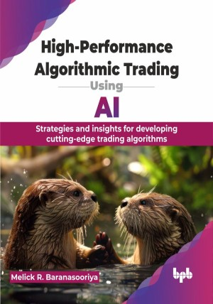

# High-Performance Algorithmic Trading Using AI

Strategies and insights for developing cutting-edge trading algorithms

This is the repository for [High-Performance Algorithmic Trading Using AI
](https://bpbonline.com/products/high-performance-algorithmic-trading-using-ai?variant=44014301085896),published by BPB Publications.

## About the Book
"High-Performance Algorithmic Trading using AI" is a comprehensive guide designed to empower both beginners and experienced professionals in the finance industry. This book equips you with the knowledge and tools to build sophisticated, high-performance trading systems. It starts with basics like data preprocessing, feature engineering, and ML. Then, it moves to advanced topics, such as strategy development, backtesting, platform integration using Python for financial modeling, and the implementation of AI models on trading platforms. Each chapter is crafted to equip readers with actionable skills, ranging from extracting insights from vast datasets to developing and optimizing trading algorithms using Python's extensive libraries. It includes real-world case studies and advanced techniques like deep learning and reinforcement learning. The book wraps up with future trends, challenges, and opportunities in algorithmic trading.

Become a proficient algorithmic trader capable of designing, developing, and deploying profitable trading systems. It not only provides theoretical knowledge but also emphasizes hands-on practice and real-world applications, ensuring you can confidently navigate and leverage AI in your trading strategies. 

## What You Will Learn
• Develop AI-powered trading algorithms for enhanced decision-making and profitability.

• Utilize Python tools and libraries for financial modeling and analysis.

• Extract actionable insights from large datasets for informed trading decisions.

• Implement and optimize AI models within popular trading platforms.

• Apply risk management strategies to safeguard and optimize investments.

• Understand emerging technologies like quantum computing and blockchain in finance.
